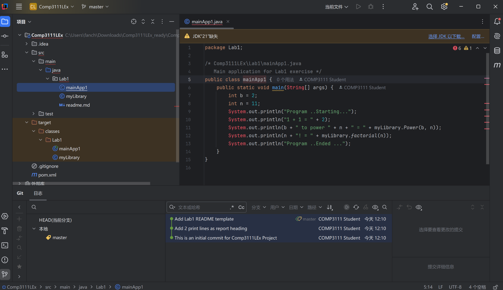

# COMP3111 Lab 1 - Git & GitHub

This folder contains the two Java source files used in COMP3111 Lab 1.

## Files

- `myLibrary.java`: provides recursive `Power` and `factorial` methods.
- `mainApp1.java`: runs a small example using the library.

## Remarks

This lab practices creating a Maven Java project in IntelliJ IDEA, placing the project under Git version control, making multiple commits, and publishing the project to GitHub.

## IntelliJ project screenshot

The final submission screenshot should show all of the following in one IntelliJ IDEA window:

1. **Project** tool window with `.idea` and `src` expanded.
2. The editor showing `myLibrary.java` or `mainApp1.java`.
3. **Git | Log** with at least three commits visible.

Save your real screenshot as `Lab1_IntelliJ.png` in this same folder, then keep the line below:

